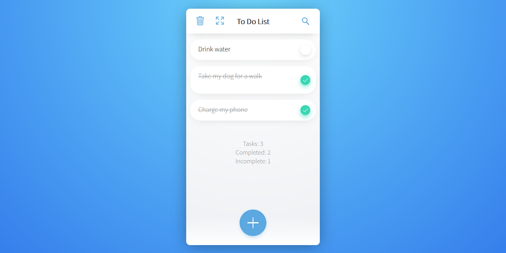

# To Do List

With this web app you can add tasks to do, mark them as completed ✅, and delete them whenever you want.

Oh! and the data is preserved if you reload the page 😄



## Demo 🚀

_You can open this link on both desktop and mobile._

[https://leonardomeza87.github.io/to-do-list/](https://leonardomeza87.github.io/to-do-list/)

## Download ⚙️

_This project does not have any dependencies, it is pure HTML, CSS and JS code._

To download it copy the code below and paste it in your terminal.

```
git clone https://github.com/leonardomeza87/to-do-list.git
```

## Donations 🎁

If you want to support me, sponsor me through these links:

- [Ko-fi](https://ko-fi.com/meza87) ☕
- [PayPal](https://www.paypal.me/universedll) 🐟

---

2 cups of ☕ were used in this repository. 😊
